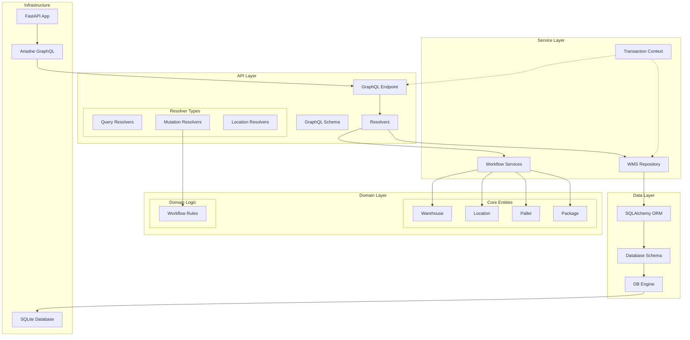
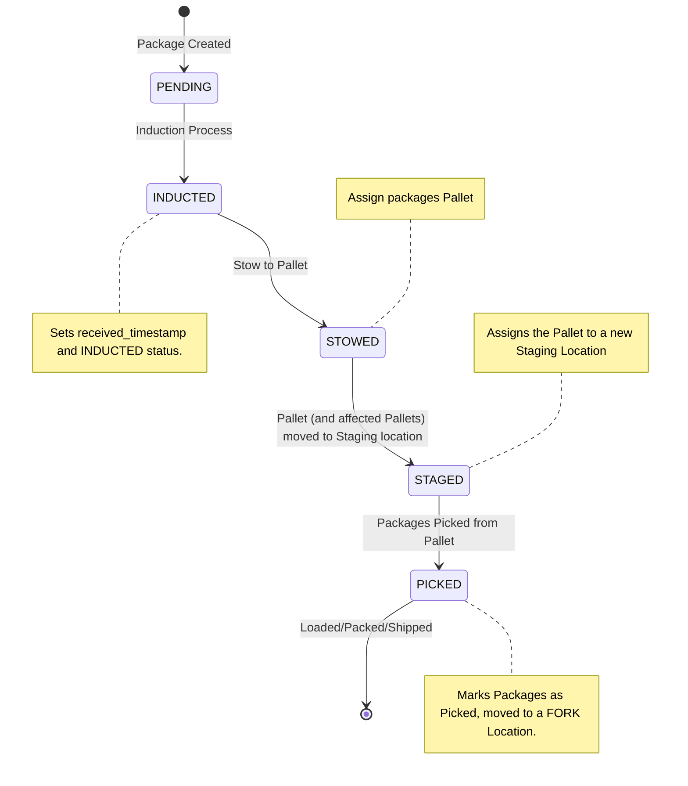
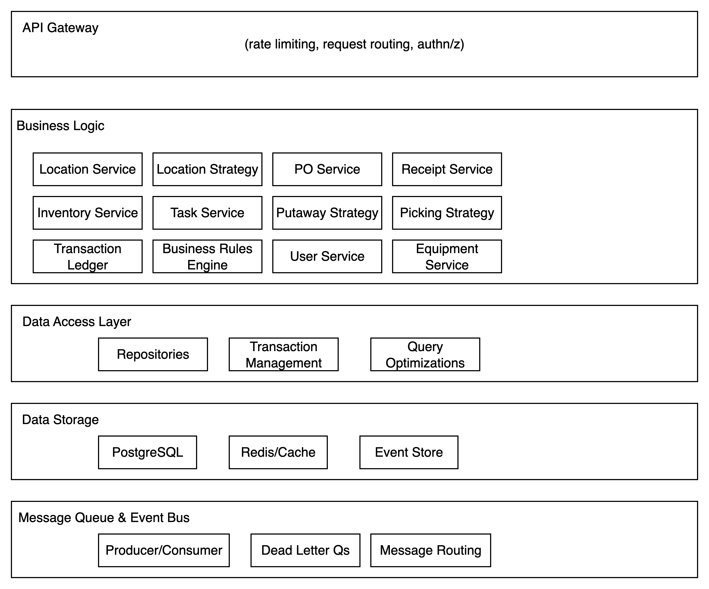

# Veho WMS Architecture

## Current System Architecture

## Current Workflow Implementation

* Induction
  * Validate packages exist in the system and haven't been Inducted yet
* Stow
  * Validate the Pallet Location (if pallet id provided otherwise create new one) is in a RECEIVING zone
  * Validate given Packages aren't already STOWED
* Stage
  * Validate Pallet current Location and not already Staged
* Pick
  * Validate that > 0 Packages exist at that Location (and on a Pallet)
  * Decrement # of Packages on that Pallet & dissolve Pallet (delete if empty)
  * Place Packages in a different Pallet (FORK Location) of the User

## Extensibility Architecture for Full WMS

## Key Extensibility Points

### 1. Service Layer Extensions

- Key Points
  - Inventory Service
    - centralized service layer for managing alloperations that affect inventory (induction, movement, cycle counting changes, etc)
    - additional inventory attributes
      - expiration
      - product characteristics (weight, dimensions, description, etc)
    - allocation
  - Location Strategy
    - physical mapping of Facility locations
    - inventory compatibility restrictions (HAZMAT, BIN, BULK)
    - operational restrictions (STORAGE, PICKING, PUTAWAY, REPLEN)
    - capacity restrictions
  - Transaction Ledger
    - all operations performed in the WMS are logged as distinct transactions
  - Picking/Putaway/CycleCounting/Location Strategies
    - optimal routing of pick/put/cycle count paths
  - Task management
    - user assignment and work queue management

## Migration Path

### Phase 1: Current State ✅
- [x] Core domain entities (Warehouse, Location, Package, Pallet)
- [x] Basic workflows (Induct, Stow)
- [x] GraphQL API with proper resolvers
- [x] Transaction management
- [x] Repository pattern

### Phase 2: Service Layer Enhancement
- [ ] Business rules engine
- [ ] Task management system
- [ ] Inventory allocation service
- [ ] Advanced location strategies

### Phase 3: Integration & Scaling
- [ ] External system integrations
- [ ] Message queue architecture
- [ ] Event sourcing implementation
- [ ] Advanced analytics and reporting

### Phase 4: Operations & Monitoring
- [ ] Real-time dashboards
- [ ] Performance optimization
- [ ] Multi-tenant architecture
- [ ] Advanced workflow orchestration

### Scalability
- **Current**: SQLite for development simplicity
- **Future**: PostgreSQL with read replicas, caching layers
- **Extension Point**: Database abstraction allows easy migration

### Performance
- **Current**: Simple repository queries
- **Future**: Query optimization, indexing strategies, caching
- **Extension Point**: Repository pattern abstracts data access

### Reliability
- **Current**: Transaction management with rollback
- **Future**: Circuit breakers, retry policies, dead letter queues, idempotency
- **Extension Point**: Service layer can add reliability patterns

### Observability
- **Current**: Basic logging
- **Future**: Distributed tracing, metrics, alerting
- **Extension Point**: Middleware layers for cross-cutting concerns

